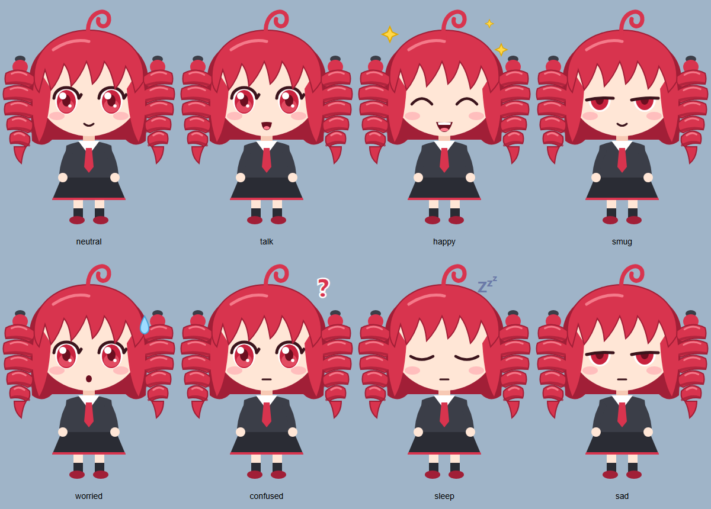

# Teto Desktop

A chibi desktop assistant who lives on your screen, has quirks and
animations, and does real work: behind her speech bubble is
[Claude Code](https://code.claude.com/docs/en/overview), running headless.
Every action she wants to take on your PC shows up in her bubble with
**Allow / Deny** buttons.

It's also a **polyglot learning project**: nine languages, each in its own
folder and doing the job it's best at, linked to each other with a
*different* technique every time (FFI, WebAssembly, pipes, HTTP,
Server-Sent Events, named pipes, Tauri IPC).



## Repository layout: one folder per language

| Folder | Language | Component | Linked to the rest by |
| --- | --- | --- | --- |
| [`rust/`](rust/) | Rust | `shell/`: the transparent, always-on-top desktop window (Tauri); starts every helper | Tauri IPC ↔ TypeScript, **FFI** → C |
| [`c/`](c/) | C | `win32hooks/`: idle time, cursor, global hotkey, kill-helpers-on-exit | C ABI (static library linked into Rust) |
| [`typescript/`](typescript/) | TypeScript | `ui/`: animator, speech bubble, command bar, skin loader | HTTP + **SSE** → Go, **WebAssembly** → C++ |
| [`javascript/`](javascript/) | JavaScript | `quirks/`: personality plugins; `tools/ui_probe.mjs` | dynamic `import()` |
| [`cpp/`](cpp/) | C++ | `physics/`: spring-chain physics for the drills | compiled to **WebAssembly** |
| [`go/`](go/) | Go | `brain/`: drives Claude Code, permission prompts, wiring | **stdin/stdout JSON** ↔ Claude Code & Python |
| [`python/`](python/) | Python | `mood/`: reply → emotion; `skin_gen/`: the art; `tools/` | JSON lines over pipes |
| [`java/`](java/) | Java | `reminders/`: the reminder service | HTTP (form in, JSON out) |
| [`csharp/`](csharp/) | C# | `Companion/`: tray icon, notifications, voice | Windows **named pipe** |
| [`assets/`](assets/) | SVG | `skins/teto-chibi/`: the art + manifest (swappable) | data |
| [`docs/`](docs/) | – | workspace-level docs | – |

Each language folder has its own `README.md` (build/test commands),
`docs/CONCEPTS.md` (**every concept and principle used in that language,
with where and why**), and `CHANGELOG.md`.

## How it fits together

```text
 you ─► [TypeScript UI in the Rust/Tauri window] ◄── native events ── Rust ──FFI──► C (Win32)
             │  ▲                ▲
   HTTP POST │  │ SSE            └── WebAssembly ── C++ hair physics
             ▼  │
          [Go brain] ──stdin/stdout JSON──► claude -p (Claude Code)
             │  │  └──named pipe──► C# (tray, toasts, voice)
             │  └──HTTP──► Java (reminders)
             └──JSON lines──► Python (mood)
```

Details: [docs/ARCHITECTURE.md](docs/ARCHITECTURE.md).

## Setup (Windows 11)

```powershell
winget install GoLang.Go LLVM.LLVM Microsoft.DotNet.SDK.10 EclipseAdoptium.Temurin.25.JDK
winget install Microsoft.VisualStudio.BuildTools --override "--quiet --wait --add Microsoft.VisualStudio.Workload.VCTools --includeRecommended"
# plus: Rust (https://rustup.rs), Node 22.18+, Python 3.10+, Claude Code (logged in)
cargo install tauri-cli --version "^2" --locked
```

> **Smart App Control** (Windows 11) blocks Cargo's build scripts, so Rust
> can't build while it's on. See [docs/SECURITY.md](docs/SECURITY.md#developer-notes).

Build everything once:

```powershell
cd go/brain;          go build -o bin/teto-brain.exe .;                  cd ../..
cd cpp/physics;       npm run build;                                      cd ../..
cd java/reminders;    javac -Xlint:all -Werror -d out src/teto/reminders/*.java; cd ../..
cd csharp;            dotnet build Companion -c Release;                  cd ..
cd typescript/ui;     npm install;                                        cd ../..
```

## Run

```powershell
cd rust/shell
cargo tauri dev        # starts Vite, builds the shell, opens Teto; the shell starts every helper
```

Click Teto (or press **Ctrl+Alt+Space**) to open the command bar. Drag her
anywhere. `/remind 10m stretch` sets a reminder. Claude works in
`~/TetoWorkspace`. Helper logs: `%LOCALAPPDATA%\Teto\logs`.

## Tests

| Folder | Command | Tests |
| --- | --- | --- |
| `go/brain` | `go vet ./... ; go test -count=1 ./...` | 11, incl. permission round trip with a fake Claude, 7 security regressions |
| `python/` | `python -m unittest discover -s python/mood` | 5 |
| `cpp/physics` | `npm run build ; npm test` | 6, on the real `.wasm` |
| `typescript/ui` | `npm run typecheck ; npm test` | 9, incl. skin sanitizer |
| `java/reminders` | see [java/README.md](java/README.md) | 19 checks, incl. forged requests |
| `c/win32hooks` | see [c/README.md](c/README.md) | 7 |
| `csharp/` | `dotnet test Teto.slnx` | 13, incl. a real pipe round trip |
| `rust/shell` | `cargo test` | FFI + supervisor |
| live | `python python/tools/smoke_brain.py --token devtoken "Say hi"` | real Claude through a running brain |

## Docs

| Doc | For |
| --- | --- |
| [docs/ARCHITECTURE.md](docs/ARCHITECTURE.md) | the whole system: why it's built this way, one prompt end to end |
| [docs/SECURITY.md](docs/SECURITY.md) | threat model, defenses, security review, safe use |
| [docs/PROTOCOL.md](docs/PROTOCOL.md) | every message between the parts |
| [docs/LEARNING_PATH.md](docs/LEARNING_PATH.md) | a reading order through all nine languages, with exercises |
| [docs/LIBRARIES_AND_BUILTINS.md](docs/LIBRARIES_AND_BUILTINS.md) | every dependency and standard-library module, and why |
| [docs/CONVENTIONS.md](docs/CONVENTIONS.md) | layout, naming, commits |
| `<language>/docs/CONCEPTS.md` | the language deep-dives |
| [CHANGELOG.md](CHANGELOG.md) | workspace changes |

## Art & credits

Teto's look is an **original** chibi drawing in the style of Kasane Teto
(character © TWINDRILL), generated as SVG by
[python/skin_gen/gen_teto.py](python/skin_gen/gen_teto.py). This is a
non-commercial fan project. Skins are swappable: see
[docs/ARCHITECTURE.md](docs/ARCHITECTURE.md#skins).

## License

[MIT](LICENSE) for the code. The Kasane Teto character belongs to TWINDRILL;
the MIT license does not grant any rights to the character.

## References

- Claude Code, run programmatically: <https://code.claude.com/docs/en/headless>
- Tauri 2: <https://v2.tauri.app/>
- Keep a Changelog: <https://keepachangelog.com/en/1.1.0/>
